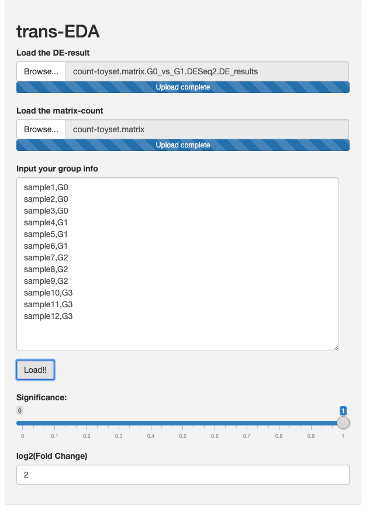

A list of r package r are requiered for run this app in your desk:

| Package        | Version used |
| -------------- | :----------: |
| data.table     |    1.12.8    |
| DESeq2         |    1.22.2    |
| DT             |     0.11     |
| heatmaply      |    1.0.0     |
| plotly         |    4.9.1     |
| reshape2       |    1.4.3     |
| shiny          |    1.4.0     |
| shinydashboard |    0.7.1     |
| tidyverse      |    1.3.0     |

1. A easy way to check/install this package in your R session, run:

```r

.cran_packages <- c('shiny', 'plotly', 'data.table', 'reshape2', 'DT', 'tidyverse', 'heatmaply')

.bioc_packages <- c('DESeq2')

.inst <- .cran_packages %in% installed.packages()

if(any(!.inst)) {
  install.packages(.cran_packages[!.inst], dep=TRUE, repos='http://cran.us.r-project.org')
}

.inst <- .bioc_packages %in% installed.packages()

if(any(!.inst)) {
  if (!requireNamespace("BiocManager", quietly = T))
    install.packages("BiocManager")
  BiocManager::install(.bioc_packages[!.inst], ask = F, suppressUpdates = T)
}

# Load packages into session, and print package version
sapply(c(.cran_packages, .bioc_packages), require, character.only = TRUE)

# Check version
ip <- installed.packages()[,c(1,3)]

rownames(ip) <- NULL

ip <- ip[ip[,1] %in% c(.cran_packages,.bioc_packages),]

print(ip, row.names=FALSE)


```

2. After check the package installation download the `app.R` file and run from an r session:

**Method 1** (Quick method)

```r
shiny::runGitHub("EDA-Transcriptomic", username = "RJEGR", ref = "master", launch.browser = TRUE, subdir = 'stable/')
```

**Method 2**

1. Click `Clone or download` button on the top of this page, then click [`Download ZIP/tar`](https://github.com/RJEGR/EDA-Transcriptomic/archive/master.tar.gz);
2. Unzip the file to your working directory (use `getwd()` to know your working directory);
3. Run the code of launching (according to your structure of working directory it may be different).

```r
shiny::runApp("~/EDA-Transcriptomic/", launch.browser = TRUE)
```

3. A deployed version can be used from [here]( https://rjhgore-dc.shinyapps.io/stable/). Also, you can make or use the [_toy_ dataset](https://github.com/RJEGR/EDA-Transcriptomic/tree/master/toydata) here and run the launched app:

```r

dds2 <- makeExampleDESeqDataSet(n=10000, m=12)

# Create fake experimental design

design <- rep(0:3, each = 3, times = 1)

design <- paste("G", design, sep="") 

colData(dds2)$condition <- factor(design)

dds2 = DESeq(dds2)

m <- data.frame(colData(dds2))

m[,3] <- rep(paste0('rep',1:3), each = 1, times = 4)

m[,4] <- colnames(dds2)

colnames(m) <- c('condition', 'sizeFactor','Rep', 'names')


res <- setResults(dds2, c('G0','G1'))

wd <- '~/Documents/GitHub/EDA-Transcriptomic/toydata/'

write.table(counts(dds2), file = paste0(wd, 'count-toyset.matrix'), quote = F, sep = '\t')

write.table(res, file = paste0(wd, "count-toyset.matrix.G0_vs_G1.DESeq2.DE_results"), sep = '\t', quote = F)


```

Copy and use the **group information** in the left-panel box in the app

```
sample1,G0
sample2,G0
sample3,G0
sample4,G1
sample5,G1
sample6,G1
sample7,G2
sample8,G2
sample9,G2
sample10,G3
sample11,G3
sample12,G3
```


Example:



